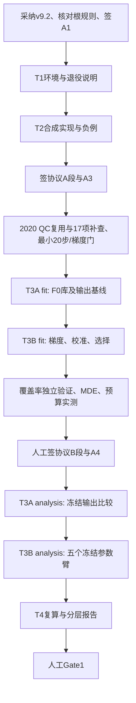

# 下一轮执行依赖与暂停点

这是待签计划图，不是已运行workflow。任务明细和拟实现CLI在TASKS.json。

暂停点不是空签署文件：

- A：未签A1/根规则未核对，不改代码。T0可选arch和batch5不挡路。
- D：阈值/日期/集合必须在新试点前签；未来QC/科学数据读取由A3授权。
- E：输入身份、坐标、最小数值门、精度或17项QC出问题，技术BLOCKED；不靠GPU多试几遍跳过门。
- H：统计资格不达标/超时为STATISTICAL_INCONCLUSIVE；MDE低功效不修改δ；预算越界不删对照臂。没有协议B段前不得启动分析。
- J之后：输出结果不能改变参数臂的拟合选择。方法缺特征按固定回退，程序失败不能丢slot。
- M：报告给建议，人做Gate判断；即使GO也不自动进入T5/2021/2022。

批准人均为用户指定的有权签署者；本版没有创建签名。会话恢复时重新核对HEAD、合同哈希、签署与已有不可变收据，从第一个未完成且已获授权的任务继续，不覆盖历史结果。
